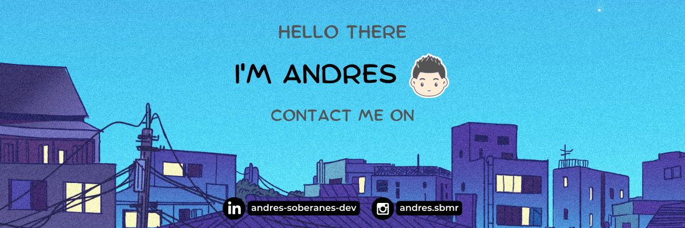

## Hi | Bienvenido | Hallo | Ciao | Allô

<h2> Welcome to My Profile 👾 </h2>

 Hi! I'm Andres Soberanes Marcelo 👩‍💻    A Junior Dev that likes Mobile and Web Development 

## My Skills

 

<!---->

 Actually I'm Technical Support Enginner, my main tasks are maintenance of computer equipment and networks, as well as attention to customer problems or questions. 

[)](https://github.com/anuraghazra/github-readme-stats)

 

